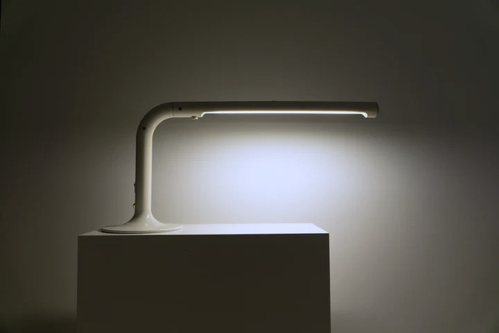

I used to think I needed to know exactly what I was making before I started. Plan everything, then build it. That seemed like the professional way to work.

But the things I'm proudest of didn't happen that way. They emerged from building the same thing multiple times, each version teaching me something I couldn't have known at the start.

The thing I got wrong was thinking coherence comes from planning. It doesn't. It&nbsp;comes&nbsp;from iteration. I&nbsp;didn't design my way to the solution. I&nbsp;discovered&nbsp;it.

The best way I can describe how this works is like entering a dark room. My first instinct is to turn on a Lamp. This gives me a broad view—I can see the general layout, where things are, what I'm dealing with. In this step everything is visible but nothing is clear yet.

As I look around, I start noticing areas that need attention. Dark corners. Details I can't quite make out. That's the first sign to build a flashlight. I have to build the solution for that specific problem I found. This lets me examine one area deeply. I can move it around. Point it at different spots. Try different angles. Learn what is actually there.

I've worked on projects that stayed at this level. Using lamps to see broadly, maybe one flashlight to investigate something specific, then shipped. The result? Shallow product thinking.

But when you take the time to build enough flashlights and start moving them around, making mistakes and rebuilding them—you start seeing patterns. This corner needs attention. That corner too. These three things relate to each other. The flashlights show you what's real.

That's when you need something more powerful. Not more flashlights, but something that concentrates everything you learned. That's a laser. Flashlights illuminate. Lasers cut through.

That's dense design. Fewer elements, each one refined through multiple iterations, all working towards the same purpose. Nothing extra. Just the essential parts. The coherence comes from knowing how those elements relate because you've examined each one closely.

<figure>
  
  <figcaption>
    <a href="https://www.are.na/block/42205371">(source)</a>
    
Desk lamp designed by Anders Pehrson

  </figcaption>
</figure>

## Why this is hard

The world has a tendency to treat the investigation phase as wasted time. "We should have known the answer before we started building." But I don't think you can. The only way I've found to discover what's real is to look closely. Multiple times. From different angles.

That's not preparation for the real work. That is the real work. The laser is just what emerges when you've done enough of it.

Companies stay at lamp-level because lamps feel safer. You can see everything at once. You're not committing to any particular direction. Building flashlights means admitting you don't know everything yet, means potentially getting it wrong and spending time with hard problems. But lamps produce scattered light. Nothing particularly unique for the user.

Products that feel "almost good" usually stopped at one flashlight. They found one problem, built one focused solution, then stopped. But one isn't enough. You need to build more. Move around. See how different parts connect. Learn what really matters.

When users encounter dense and coherent design, they don't think about the interface. They think through it. The system makes sense without explanation because everything connects naturally.

You can't fake this. You have to do the slow work.

Most products stop too early. They only used lamps, or built only one flashlight and shipped. The insanely great ones come from people who keep iterating long after everyone else has stopped.